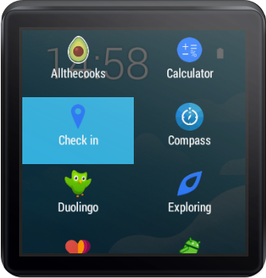
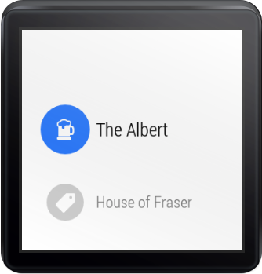
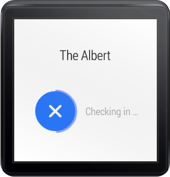
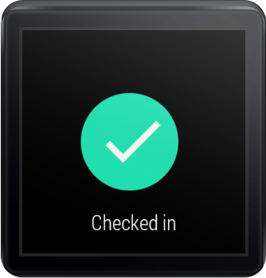
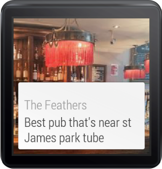
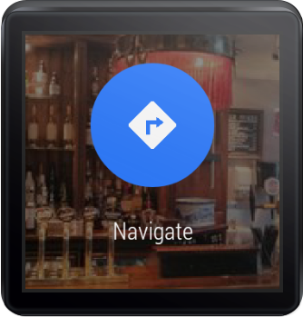
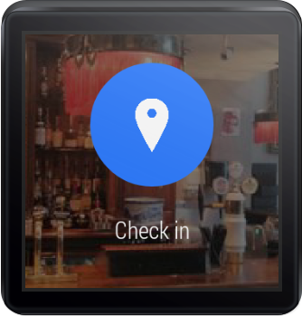
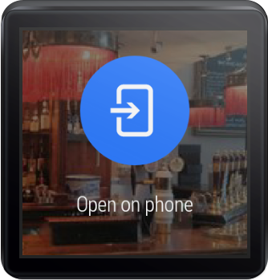

WearSquare
==========

Unofficial Foursquare® Client for Android Wear.

## Download:

 

([join the beta](https://plus.google.com/communities/101759563856154570864))

## Features:

### Lightning fast check-in from your watch:
 

### Quickly explore your neighbourhood:
 

Future plans
-----
- report bugs and feature requests as issues here
- pull requests are welcomed!

How to build the code
---------------------
1. setup your release certificate with these values in *~/.gradle/gradle.properties*: `RELEASE_STORE_FILE`, `RELEASE_STORE_PASSWORD`, `RELEASE_KEY_ALIAS`, `RELEASE_KEY_PASSWORD`
2. setup your Foursquare API keys with these values in *~/.gradle/gradle.properties*: `WSQ_4SQ_CLIENT_ID`, `WSQ_4SQ_CLIENT_SECRET`. (Obtain these values from [Foursquare developers](https://developer.foursquare.com/))
3. launch `./gradlew assembleDebug` or `./gradlew assembleRelease`

* You can also import the code into Android Studio if you select top-level build.gradle file and Gradle wrapper during import.

Author
-----
- [David 'Destil' Vávra](http://www.destil.cz)
- [Follow me on G+](http://google.com/+DavidVávra) to be notified about future versions
 

This app uses the Foursquare API but is not affiliated with or endorsed by Foursquare Labs, Inc. All of the Foursquare® logos (including all badges) and trademarks displayed on this application are the property of Foursquare Labs, Inc.
